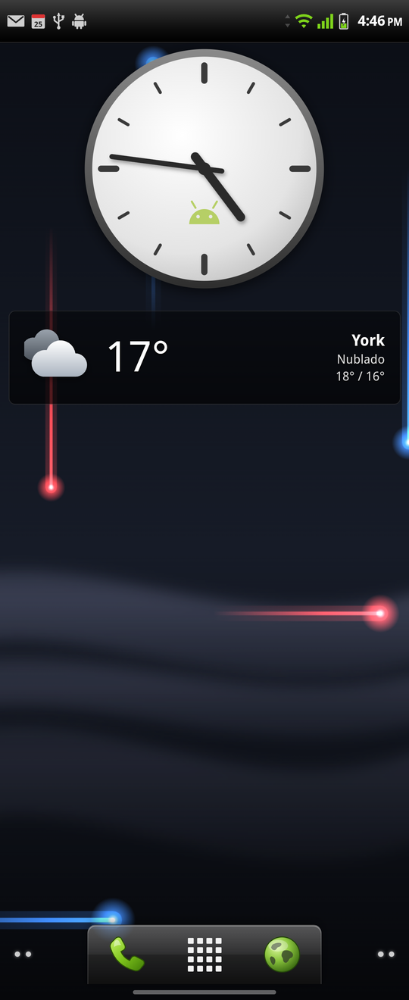

# Gingerbread Launcher

Una recreación del launcher de **Android 2.3 Gingerbread** para teléfonos actuales, hecha como proyecto web para [Bridge Launcher](https://github.com/bridgelauncher/launcher).

Bridge es una app de Android que usa una página web como pantalla de inicio y le da acceso a funciones del sistema (lista de apps, abrir apps, fondo de pantalla, barras del sistema…). Este repositorio es esa página web: está hecho con Vue 3, TypeScript y Vite, y no contiene código nativo de Android.

Funciona con el Bridge original, y con **[nuestro fork de Bridge](https://github.com/njpd57/bridge-launcher)** gana funciones que la API original no permite: notificaciones reales, música, calendario, ajustes rápidos, señal real, accesos directos de apps, búsqueda web y más. En esta página, lo que solo funciona con el fork dice **"con nuestro fork"**.

<p align="center">
  
</p>

## Funciones

- **5 pantallas de inicio** que se recorren deslizando. Arranca en la del centro, y el botón de inicio de Android vuelve a ella.
- **Dock de Gingerbread**: Teléfono · Cajón de apps · Navegador (con nuestro fork, tus apps predeterminadas). A los lados, los puntos indican cuántas pantallas quedan hacia cada lado; al tocarlos cambias de pantalla.
- **Cajón de apps**: cuadrícula de 4 columnas sobre fondo negro, con animación de zoom y botón de inicio para cerrarlo. Su botón de lista abre **Administrar aplicaciones**, que lleva a la ficha de cada app en Android.
- **Escritorio editable**:
  - Mantén pulsada una app del cajón para arrastrarla al escritorio.
  - Mantén pulsado un icono o widget para moverlo. Si lo llevas al borde, pasa a la pantalla siguiente.
  - **Accesos directos** (con nuestro fork): al mantener pulsada una app, en el escritorio o en el cajón, aparece un menú con sus accesos ("Nuevo mensaje", "Ir a casa"…) e "Información de la app". Si en vez de soltar mueves el dedo, el menú se cierra y arrastras la app.
  - Durante el arrastre, el dock se convierte en una papelera: quita elementos del escritorio, y si la app viene del cajón, la **desinstala** (Android pide confirmación).
  - Al instalar una app, su icono se añade solo al escritorio, como hacía el Market (se puede desactivar).
- **Carpetas**:
  - Arrastra apps encima de una carpeta para meterlas.
  - Tócala para abrirla y toca su título para cambiarle el nombre.
  - Desde una carpeta abierta puedes sacar apps arrastrándolas.
- **Widgets**: reloj analógico (2×2), reloj analógico grande (4×2) y reloj digital (4×1, con la fuente del reloj de Android 2.x) — los tres abren tus alarmas al tocarlos (con nuestro fork, en la app de reloj que uses; si no, la primera app de reloj conocida), y con nuestro fork el digital muestra la próxima alarma junto a la fecha —, calendario del mes (4×2; con nuestro fork de Bridge, marca los días con eventos), **Agenda** (4×2, con nuestro fork: los próximos eventos de tu calendario), batería (1×1; con nuestro fork, también dice si carga por USB, cargador o inalámbrico), frase del día (4×1), el tiempo (4×1) con datos de [Open-Meteo](https://open-meteo.com/), **Pronóstico** de 5 días (4×2), **Sol y luna** (2×1: fase lunar y horas del sol), **Cuenta regresiva** (2×1), **Cronómetro y temporizador** (2×1), **Nota** (2×2), **Tareas** (2×2), **Calculadora** (4×3), **Titulares** de un feed RSS (4×2; solo feeds que permitan leerse desde otra página, como el de Cooperativa.cl, que trae por defecto), **Control de energía** (4×1) con bloquear pantalla, modo noche, notificaciones y ajustes (con nuestro fork de Bridge: Wi-Fi, Bluetooth, modo de sonido, sincronización y brillo, como el original pero con el modo de sonido en lugar del GPS; mantén pulsado el brillo para el modo noche, la sincronización para bloquear y el modo de sonido para el volumen), **Apps más usadas** (4×1), **Tiempo de pantalla** (4×1, con nuestro fork: tu uso de hoy y tus apps más usadas), **Marco de fotos** (2×2, con nuestro fork: una foto con marco blanco, elegida de la galería), **Música** (4×1) y **Música estilo Songbird** (4×1), los dos con nuestro fork: carátula, título y controles de lo que suena, **Búsqueda de aplicaciones** (4×1): la barra de búsqueda de Gingerbread, que abre un buscador de apps instaladas y, con nuestro fork, de contactos (sin tildes ni mayúsculas, con las apps recientes; también busca en la web), **Contactos favoritos** (4×1, con nuestro fork: tus contactos con estrella, toca uno para llamarlo, mandarle un mensaje o ver su ficha), y **Marcación directa** / **Mensaje directo** (1×1 cada uno, con nuestro fork: eliges un contacto y un número al añadirlos, y quedan para llamarlo o escribirle directo).
- **Fondos animados de Gingerbread**, recreados en el launcher:
  - **Nexus**: pulsos de luz de colores que recorren la pantalla. Al tocar un hueco vacío salen pulsos desde ese punto. Se puede configurar la cantidad de pulsos y la velocidad.
  - **Hierba**: hierba mecida por el viento, con un cielo que sigue la hora del día (usa la salida y puesta del sol de la ciudad del widget del tiempo).
  - **Galaxia**: una galaxia espiral que gira despacio.
  - **Humo mágico**: humo de colores que cambia de color; al tocar un hueco vacío sale una bocanada.
  - **Reloj polar**: la hora, el día y el mes en anillos de colores.
  - En todos se puede elegir la fluidez: 30, 60 o 120 fps.
  - También puedes usar el fondo de pantalla del sistema. Si es un fondo animado, al tocar un hueco vacío reacciona como en Gingerbread.
- **Menú de opciones** (mantén pulsado un hueco vacío): Añadir, Fondo de pantalla, Apariencia, Notificaciones, Ajustes y Bridge.
- **Apariencia**:
  - Barra de estado **nativa** (la del sistema) o una **barra propia de Gingerbread**, que muestra la hora y la batería reales.
    - **Con nuestro fork**, también son reales la señal móvil, el Wi-Fi, las flechas de datos, el icono de USB y los iconos de notificaciones (con el acceso a notificaciones), y como en 2.3 aparecen iconos de Bluetooth, alarma puesta, GPS y timbre en vibrar o silencio. Al tocarla se abre el **panel de notificaciones** del launcher (ver abajo).
    - Con la barra Gingerbread, las pantallas propias de Bridge (sus ajustes, su consola) pasan a tema oscuro; al volver a la barra nativa, recuperan el tema que tenían.
    - Con el Bridge original, la señal y el Wi-Fi son simulados (suben y bajan poco a poco), los iconos de notificaciones son decorativos y al tocarla se abre la cortina de Android.
  - Fondo de la barra de estado: transparente, degradado gris, degradado negro, blanco o negro.
  - Altura de la barra de estado: automática o manual.
  - Número de filas de la cuadrícula: automático según el alto de la pantalla, o de 4 a 7.
  - Tamaño de los iconos, de 75 % a 130 %. En el escritorio no crecen más de lo que cabe en cada celda.
  - Mostrar u ocultar el botón flotante de Bridge.
  - **Brillo naranja** de Gingerbread al llegar al final de una lista, o el efecto de Android.
  - Añadir o no el icono de las apps que instalas.
- **Panel de notificaciones** (con nuestro fork): baja al tocar la barra de estado Gingerbread o el botón de notificaciones del Control de energía.
  - Arriba, **ajustes rápidos**: linterna, brillo (automático, bajo, medio, alto), rotación, sincronización y modo de sonido (sonido, vibrar, silencio) cambian de verdad; mantén pulsado el modo de sonido para ajustar el **volumen multimedia**. Wi-Fi y Bluetooth muestran si están encendidos y abren el panel de Android, porque las apps ya no pueden cambiarlos.
  - Debajo, el **reproductor** de lo que suena y las notificaciones en "En curso" y "Notificaciones", como en Gingerbread. Al tocar una se abre, y "Borrar" descarta las que se pueden descartar.
  - Se cierra con la barra de abajo, con Atrás o con el botón de inicio.
- **Aviso de batería baja** como el de 2.3: al bajar al 15 % y al 5 %, "Conecta el cargador".
- **Pantalla fija en vertical** con nuestro fork (el launcher se lo pide a Bridge al arrancar).
- **Aspecto de Gingerbread**: tipografía Droid Sans (y Clockopia en el reloj digital), dock de cristal, sombra bajo los iconos y el naranja de Gingerbread al pulsar.

La configuración y el diseño del escritorio se guardan en el propio teléfono.

## Instalación en el teléfono

1. Instala [Bridge Launcher](https://github.com/bridgelauncher/launcher), o [nuestro fork](https://github.com/njpd57/bridge-launcher) para tener todas las funciones, y ponlo como launcher predeterminado. El fork se compila con `./gradlew assembleDebug` y se instala con `adb install`. Tiene otra firma que el Bridge publicado, así que antes hay que desinstalar el original.
2. Descarga el proyecto y genera el build:
   ```bash
   git clone https://github.com/njpd57/gingerbread-bridge-launcher
   cd gingerbread-bridge-launcher
   npm install
   npm run build
   ```
3. Copia el **contenido** de la carpeta `dist/` a una carpeta del teléfono, por ejemplo `Projects/gingerbread-launcher`.
4. En los ajustes de Bridge, elige esa carpeta como *project dir*.

Si tienes el teléfono conectado con `adb`, los pasos 2 y 3 se hacen de una vez:

```bash
npm run deploy                       # copia a /sdcard/projects/gingerbread-launcher
npm run deploy -- /sdcard/otra/ruta  # u otra carpeta
```

Para activar el botón del modo noche, mira [Permisos opcionales](#permisos-opcionales).

**Recomendado:** en **Apariencia**, oculta el botón flotante de Bridge, que tapa el dock. En los ajustes de Bridge, ajusta el color de los iconos de la barra de estado según el fondo que elijas para ella.

## Permisos opcionales

Algunas funciones necesitan permisos que Bridge no pide por sí solo. Sin ellos el launcher funciona igual, pero esos botones del widget **Control de energía** o del panel de notificaciones se ven apagados y, al tocarlos, explican qué falta.

| Función | Qué hace falta | Cómo |
|---|---|---|
| **Modo noche** (botón de la luna) | Permiso `WRITE_SECURE_SETTINGS` para Bridge | Con el teléfono conectado por adb (depuración USB activada): `npm run grant-permissions`, o a mano: `adb shell pm grant com.tored.bridgelauncher android.permission.WRITE_SECURE_SETTINGS` |
| **Agenda** y eventos en el calendario del mes | Nuestro fork de Bridge y el permiso de calendario | En el widget Agenda, toca "Toca para permitir el acceso al calendario" y acepta el diálogo de Android. Si lo rechazaste para siempre, se abren los ajustes de Bridge para darlo a mano |
| **Música** (widget y panel de notificaciones) | Nuestro fork de Bridge y el acceso a notificaciones | El mismo acceso que las notificaciones reales: Android solo muestra qué suena a las apps con ese acceso |
| **Contactos favoritos**, **Marcación**/**Mensaje directo** y contactos en la búsqueda | Nuestro fork de Bridge y el permiso de contactos | Al tocar cualquiera de esos widgets por primera vez, se abre el diálogo de Android para leer tus contactos |
| **Marcación directa** llamando de una vez, en vez de abrir el marcador | Además del permiso de contactos, el permiso de llamada | Se pide aparte, la primera vez que intentas llamar directo. Sin él, el widget abre el marcador con el número ya escrito |
| **Notificaciones reales** en la barra de estado Gingerbread | Nuestro [fork de Bridge](https://github.com/njpd57/bridge-launcher) y el acceso a notificaciones | En **Apariencia**, con la barra Gingerbread elegida, toca "Mostrar notificaciones reales" y activa Bridge en la pantalla que se abre. Sin el acceso, los iconos de notificaciones son decorativos |
| **Brillo y rotación** en el panel de notificaciones (el brillo también en el widget Control de energía) | Nuestro fork de Bridge y el permiso "Modificar ajustes del sistema" | Al tocar esos botones por primera vez se abre la pantalla del permiso: activa Bridge. Linterna y sincronización no necesitan permiso. Wi-Fi y Bluetooth solo abren el panel de Android, porque las apps ya no pueden cambiarlos |
| **Modo de sonido** (sonido, vibrar, silencio) en el panel de notificaciones y el widget Control de energía | Nuestro fork de Bridge y el permiso "Acceso a No molestar" | Al tocar el botón por primera vez se abre la pantalla del permiso: activa Bridge |
| **Apps más usadas** y **Tiempo de pantalla** con tu uso real | Nuestro fork de Bridge y el permiso "Acceso de uso" | En los ajustes de Android, *Acceso de uso* (o *Acceso a datos de uso*): activa Bridge. Sin él, "Apps más usadas" cuenta solo lo que abres desde el launcher |
| **Bloquear pantalla** (botón del candado) | El servicio de accesibilidad de Bridge y permitir el bloqueo | En Android: *Ajustes → Accesibilidad → Bridge* (activar), y en los ajustes de Bridge, permitir que el proyecto bloquee la pantalla. Después de bloquear así, se desbloquea con PIN o patrón, no con huella |

Sobre el permiso del modo noche:
- **Basta con darlo una vez.** Se mantiene al reiniciar el teléfono y al actualizar Bridge, pero **se pierde si desinstalas y vuelves a instalar Bridge**.
- No hace falta reiniciar nada: el launcher vuelve a comprobar los permisos cada vez que vuelves a él.
- Para comprobar si está dado: `adb shell dumpsys package com.tored.bridgelauncher | grep "WRITE_SECURE_SETTINGS: granted"` debe mostrar `granted=true`.
- Algunas versiones de Bridge (como la 0.1.0alpha) no pueden comprobar este permiso. En ese caso el launcher intenta el cambio igualmente y, si falta el permiso, Bridge muestra un aviso.

## Desarrollo

```bash
npm run dev          # servidor de desarrollo en el navegador
npm run build        # comprobación de tipos + build en dist/
npm run type-check   # solo comprobación de tipos
npm run test:unit    # tests (Vitest) en modo watch
npx vitest run       # tests una sola vez
```

El desarrollo se hace en la rama **`dev`**. Si tienes otros *worktrees* de git dentro de `.claude/`, Vitest también encuentra sus tests; para ejecutar solo los de este proyecto usa `npx vitest run --dir src`.

En el navegador, `window.Bridge` se reemplaza por un mock ([@bridgelauncher/api-mock](https://github.com/bridgelauncher/api)) con apps de ejemplo en `public/mock/`. Abrir una app muestra un `alert`. Para ver el diseño en tamaño de teléfono, usa la vista de dispositivo móvil de las herramientas de desarrollo. La pulsación larga se simula manteniendo pulsado el clic.

Las notas de arquitectura para trabajar en el código están en [CLAUDE.md](CLAUDE.md).

## Limitaciones

Vienen de lo que permite la API de Bridge (v0.1.0). Nuestro fork resuelve varias; estas quedan:

- **No hay widgets nativos de Android**: todos los widgets están hechos en HTML.
- **Botón Atrás**: Bridge no avisa cuando se pulsa. El cajón, la búsqueda y el panel de notificaciones se cierran con Atrás gracias al historial del WebView (comprobado en un Galaxy Z Flip5), y también con su botón de casa o el botón de inicio de Android. El menú de accesos directos todavía no se cierra con Atrás.
- **Wi-Fi, Bluetooth, GPS y datos móviles** no se pueden encender ni apagar desde el launcher (Android no se lo permite a ninguna app): los botones de Wi-Fi y Bluetooth abren el panel de Android, y el GPS no tiene botón.

Y solo con el **Bridge original**:

- No se leen las notificaciones ni la música, y no hay accesos directos de apps.
- **Teléfono y Navegador** abren la primera app instalada de una lista de apps conocidas, porque Bridge no indica cuáles son las predeterminadas.
- **Modo horizontal**: el launcher no puede impedir que la pantalla gire. Aun así, al girar **no se desordenan los iconos**: en horizontal se mantienen las filas de vertical. Si no quieres que gire, desactiva la rotación automática en el panel rápido de Android.

**Altura de la barra de estado:** Bridge (también el original) intercambia arriba e izquierda en los márgenes que informa, así que en vertical la altura de la barra le llega al launcher como 0. El launcher la calcula por otros medios; si alguna vez el contenido queda debajo de la barra, ajusta su altura a mano en **Apariencia**.

## Créditos

Basado en [Bridge Launcher API Tester](https://github.com/bridgelauncher/api-tester) de Tored, bajo licencia MIT (ver [LICENSE](LICENSE)).

Las tipografías Droid Sans y Clockopia vienen del Android Open Source Project (android-2.3.7_r1), bajo licencia Apache 2.0 (ver [src/assets/fonts/NOTICE](src/assets/fonts/NOTICE)).

- [Bridge Launcher](https://github.com/bridgelauncher)
- [Tipos de la API y mock de desarrollo](https://github.com/bridgelauncher/api)
